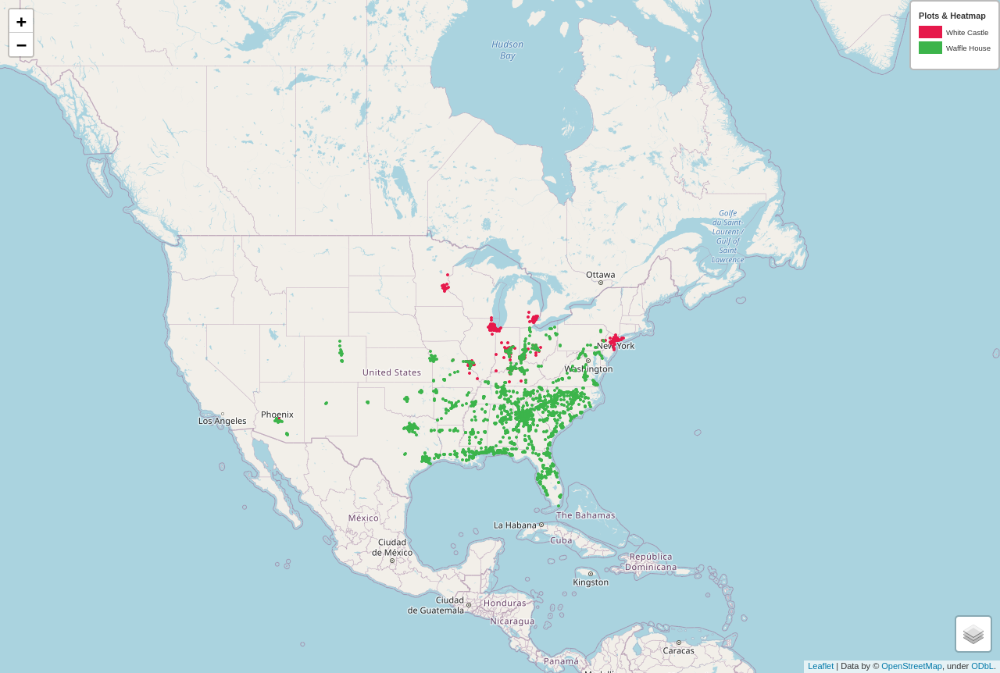
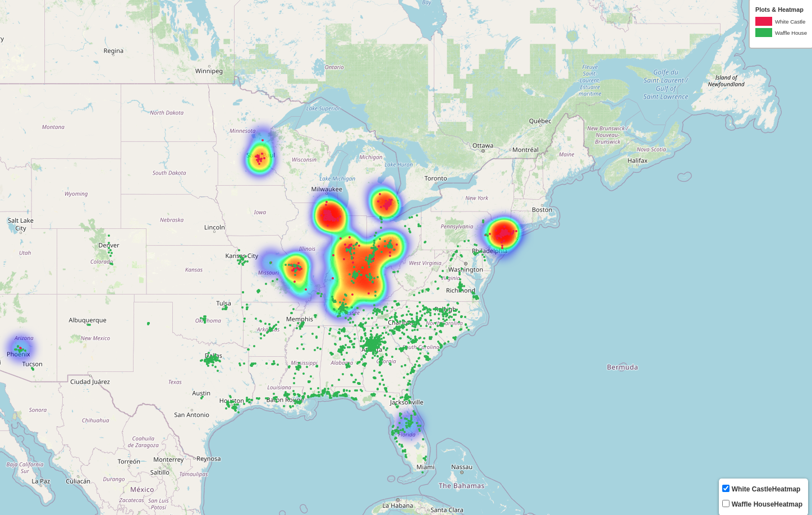

<h1>Utilizing Folium and Pandas for Creating Heatmaps</h2>
<br>
<p>Recently a member of a Google Group I'm subscribed to asked about software to create heat maps of data which contained geocoordinates.  I did my best to direct her to some Python libraries to handle this, but I realized that I'd like to put something together to empower people to quickly make heat maps.
<br>
<h2>Ensure Python 3 and Firefox are Installed</h2>
<p>Before we begin, make sure you have a version of Python 3 installed and pip.
  <br>
    Open a terminal window: 
    <ul> 
        <li>Linux:  Ctrl-Alt-T, Ctrl-Alt-F2</li>
        <li>Windows:  Win+R > type powershell > Enter/OK</li>
        <li>MacOS:  Finder > Applications > Utilities > Terminal</li>
    <ul>
</p>

<p>

Then enter:
``` 
python3 --version
```
and
```  
pip3 --version
```
</p>
<p><b>  If these commands lead to a "not found" message, move on to Install Requirements #1 below.</b>  </p>

<p>If these commands bring up a python version greater than 3.4, <b>you do not need to install python3.</b> Move on to Install Requirements #2 below.</p>

<h2>Install Requirements</h2>
<br>
<ol><li>Your version of Python should be 3.4 or greater, if it is not please go to https://www.python.org/downloads/ and install a release of Python which is version 3.4 or greater.
<br><br>
pip is included in versions of Python 3.4 or greater, so we will not need to install that separately.  </li>
<br>
<li>If you do not already have it installed, you will also need to install Firefox to run this program (https://www.mozilla.org/en-US/firefox/new/). Firefox will be interacted with by the geckodriver to display the created html and export a *.png file of the map.</li>
<br>
<li>Now back into the terminal window, change to the directory where the files from this repository are stored (for example: "cd ~/Documents/heatmapping_location_data/" or wherever you have stored the "heatmapping_location_data" folder), and type:

```
pip3 install -r requirements.txt
```

<br>This will install the python libraries listed in the requirements.txt file.
</li>
<br><br>
<h2>Create Your Heatmap</h2>
<br>
<p>While still in the "heatmapping_location_data" folder in the terminal, type:

```
python3 heatmap_location_data.py
```
<p>After a moment, a browser window for firefox will pop up with your map, do not interact with it as it is processing a *.png version of your map.  Once the browser window with the map closes, you will see a map.html file and a map.png file in the "heatmapping_location_data" folder.  The html file can be opened with any major browser.</p>  

<p>
    
    <figcaption>Map With Plotted Points, (<em> example of output map.png) </em> </figcaption>
</p>

<p>
    
    <figcaption>Heat Map With White Castle selected (<em>example of output map.html with heatmap subselection) </em> </figcaption>
</p>

<h2>Changing datasets</h2>

<p>For this example we are using csv's of the locations of White Castles and Waffle Houses in North America (datasets thanks to http://www.poi-factory.com/). You could substitute any data sets of points you would like to compare by removing the files in "csv_folder" and substituting your own. For each categorical group to be mapped, you would need to place a csv file in the "csv_folder." The categories mapped will be given the label the csv is named (i.e.the "White Castle.csv" file creates the "White Castle" datapoints on the map, and corresponding "White Castle" item in the legend.) Each csv file needs to have columns with the headings: 'latitude', 'longitude', and 'Location Name'.  This program will then go line by line through each csv, plot the given geocoordinates and label the plotted dot with the location name.  It will then create a heat map overlay for each categorical group which you can toggle on and off at the bottom right of the map, and finally a categorical legend for the individual dots so you can differentiate the data points easily.
<br>
<p>This program will be looking at the *.csv files stored in the subfolder named "csv_folder" it will utilize the names of the individidual csv files to create the categorical legend for the map and assign a varying color for each csv's plotted points. At the bottom right of the map, there will be layers button.  Clicking on this button will allow you to bring up a heat map display for each data category.  
<br>
<p>


